# 水果蔬菜商城系统(文末免费领取☟)
> 
#### 介绍
水果蔬菜商城系统(Java_SpringBoot)
有BUG可留言加微

#### 软件架构
Java + SpringBoot + Mybatis + Mysql

#### 项目功能说明

1.  管理员功能
> + 菜单管理
> + 管理员管理
> + 角色管理
> + 公告管理
> + 商品管理：商品种类列表、商品列表
> + 用户管理：用户列表、评论列表
> + 订单管理
2.  用户功能
> + 登录注册
> + 果蔬商品专区
> + 商品详情
> + 用户中心：个人信息、我的订单、我的评论、我的收藏、收货地址管理
> + 购物车

### 部分功能演示

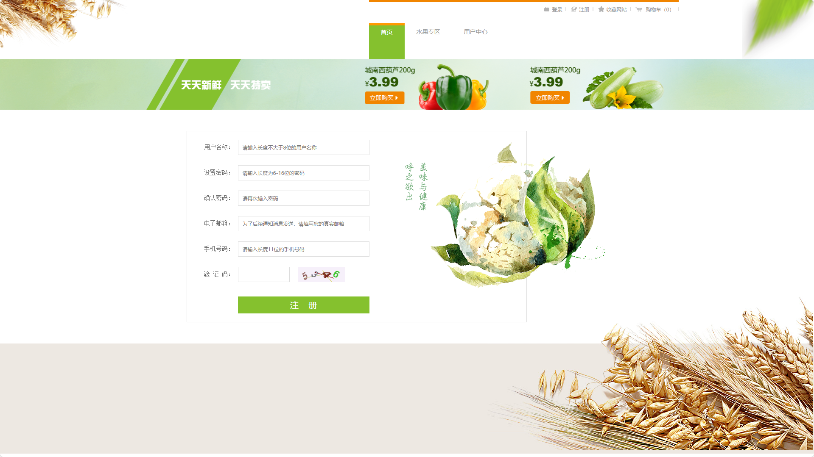

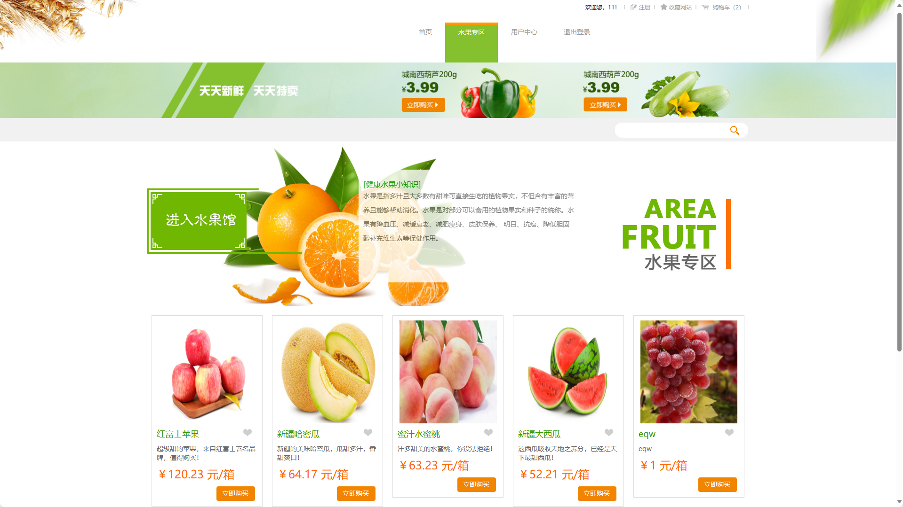
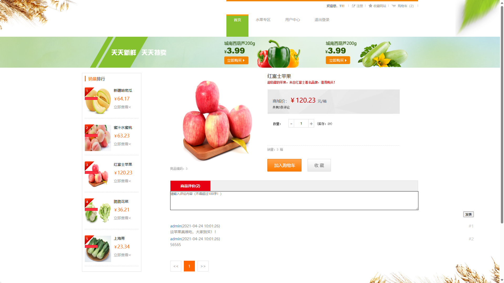
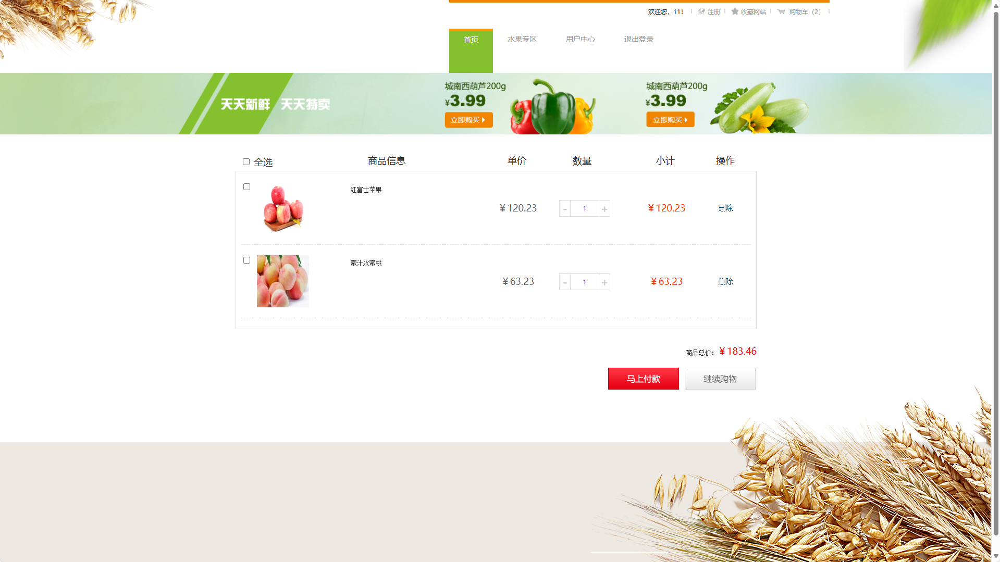
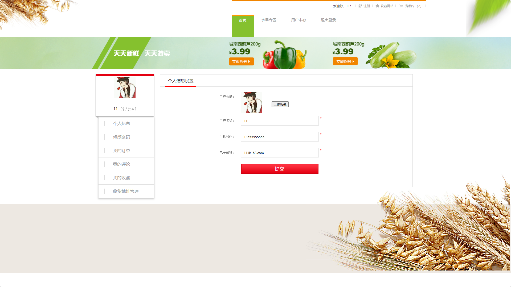
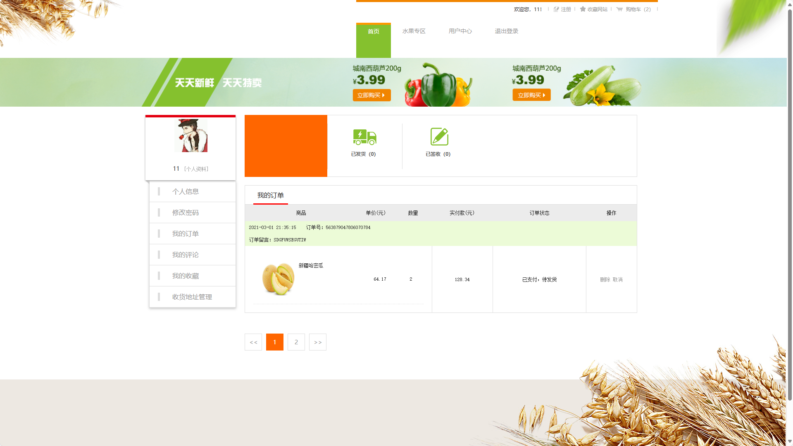
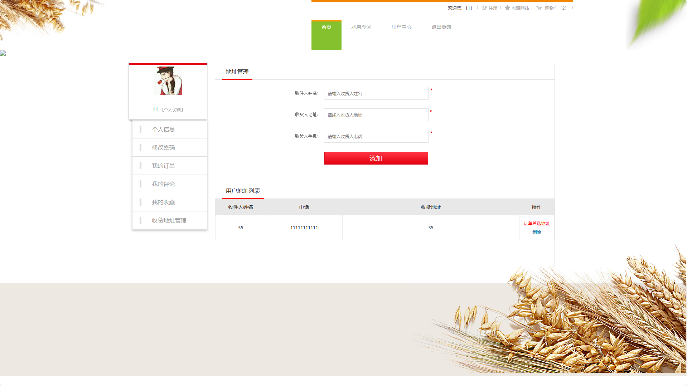
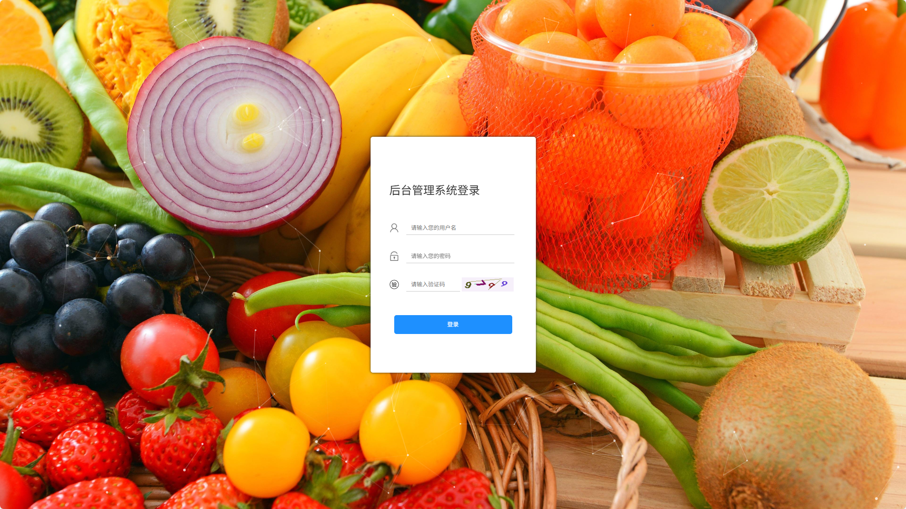
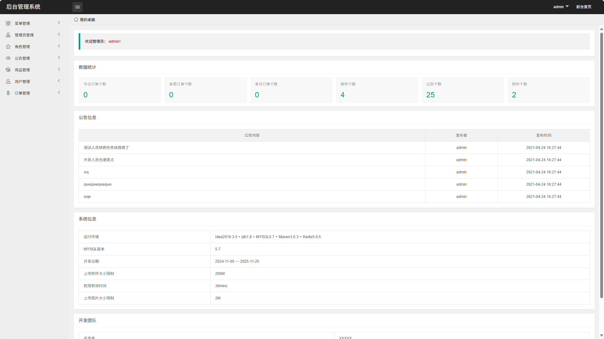
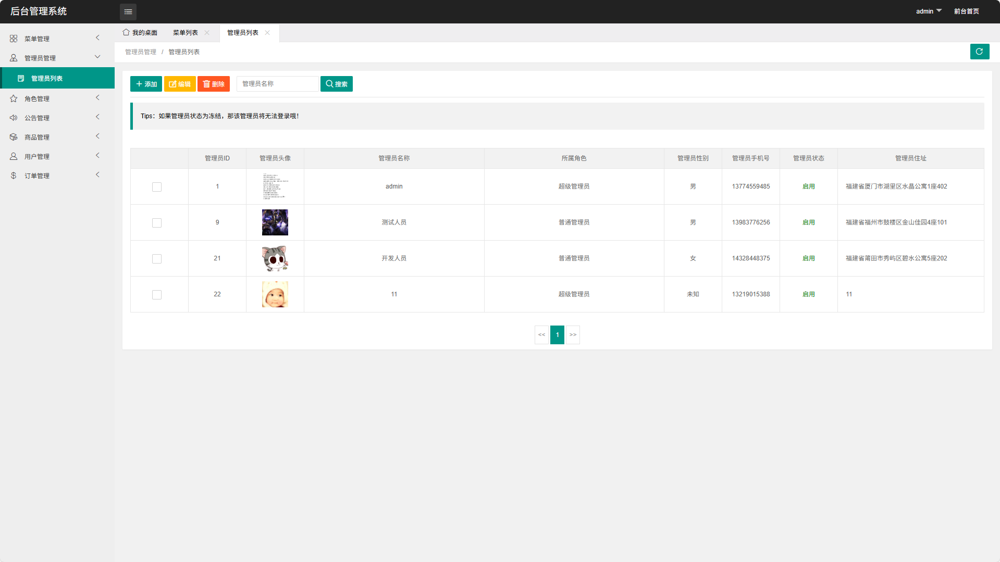
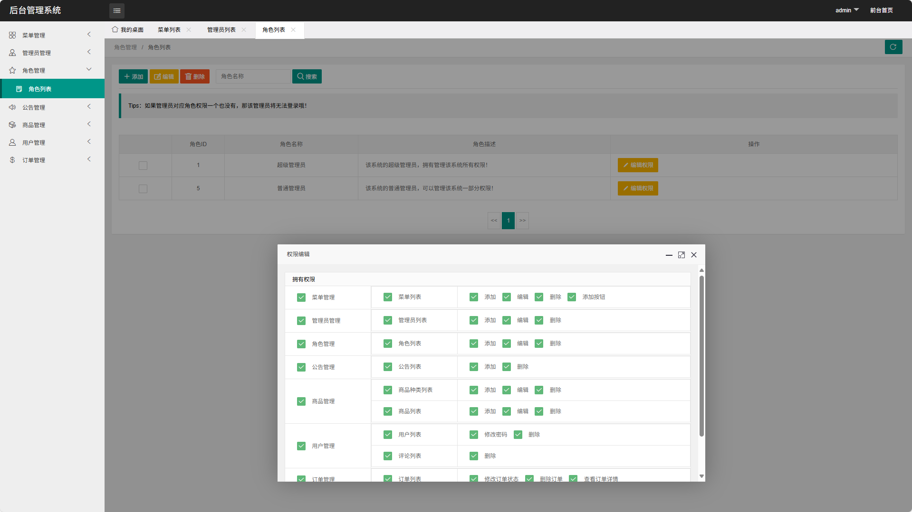
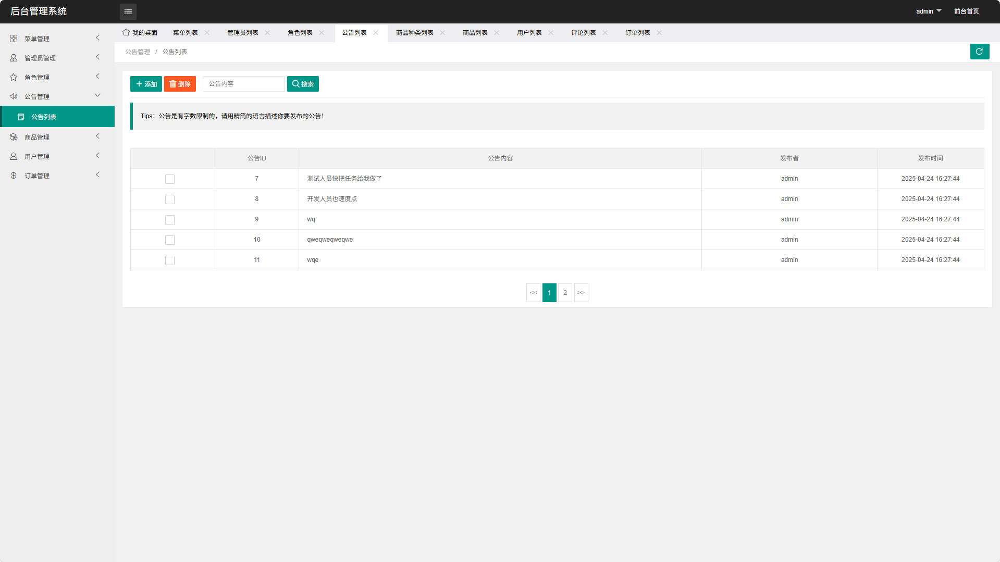
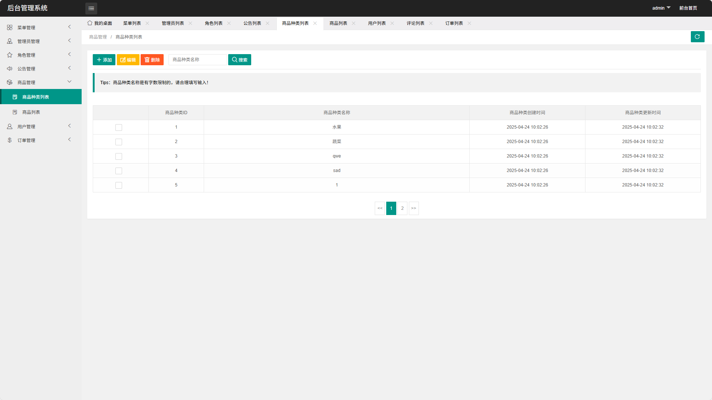
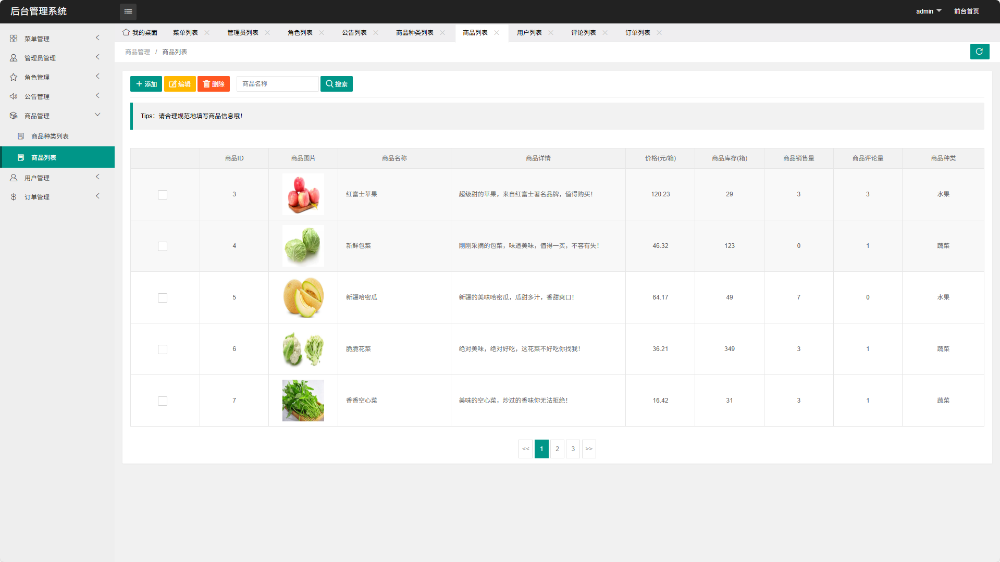
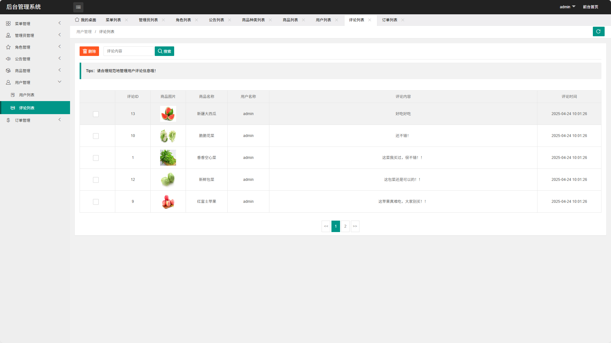
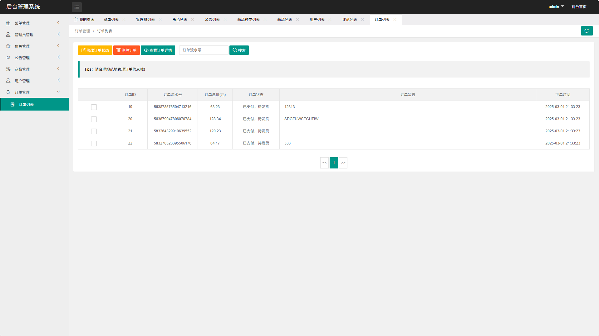

### 环境需求(可免费提供)
- idea/eclipse、jdk-1.8、maven-3.8.6、mysql、node.js等

## 有项目修改、安装调试需求 请联系以下

## 获取资源扫☝☝☝

